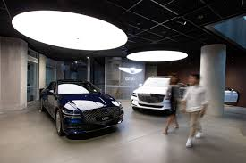
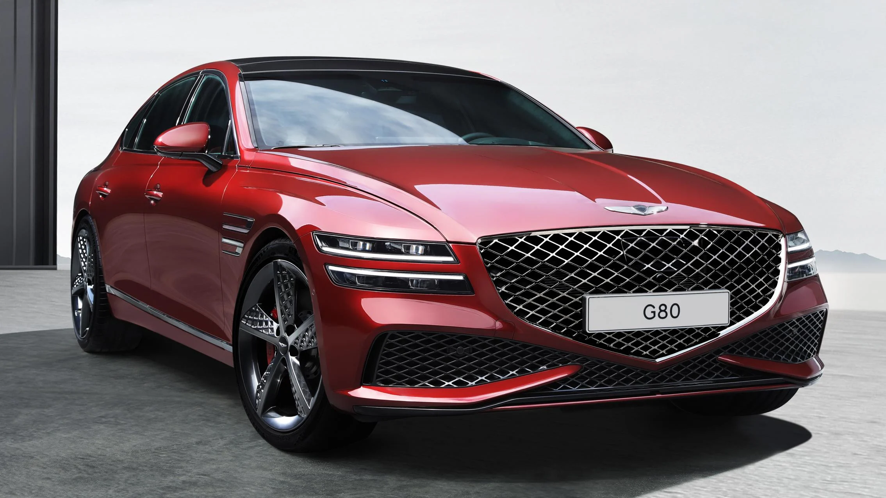

<h1> Conclusion</h1>
<h4> There are other better cars for people that don't prefer gv90 such gv80 or gv70. The gv90 description I have made may be differ from the actual features.</h4>
<h4> If buying cars and want it to be cheap make sure to buy pre owned or offers like ></h4>
<h6>(GV80 5% P.A.
COMPARISON RATE* OFFER> </h6>

<h4 align="right"> GV70 price: $47,050 to  $59,650</h4>

<h6> Gv80 is a seven seater suv comes in coupe. Or seven seater.
  </h6>Equiped with all colsion type assistance and hda also adaptive cruise control.<h6>
<H6 align="right"> gv70 is very similair to the gv80</H6>

<h4> GV80 price: from $130,000 </h4>

<h4> G80 price: about $57,100.</h4>
  
 <h4 allign="center"> This car is for people that are looking for soemthing affordable,
   and something cheap compared to other cars.. </h4>

   
  

